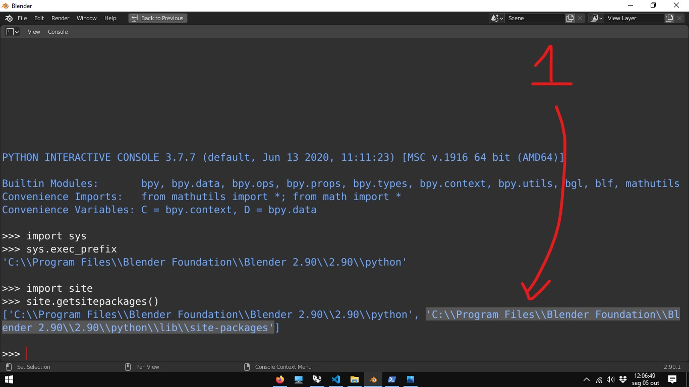
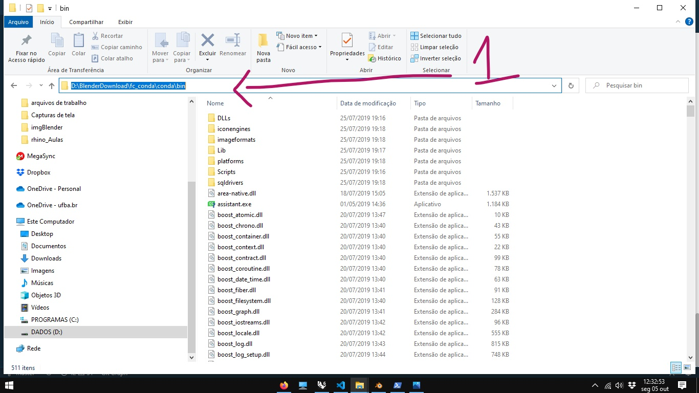
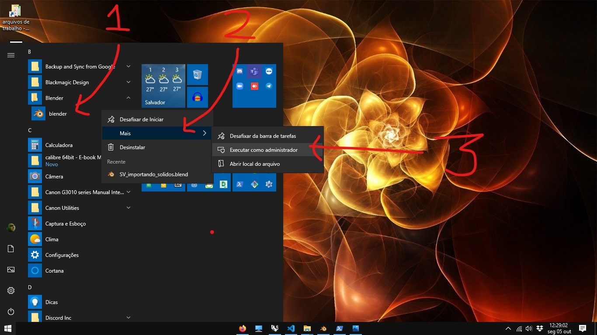
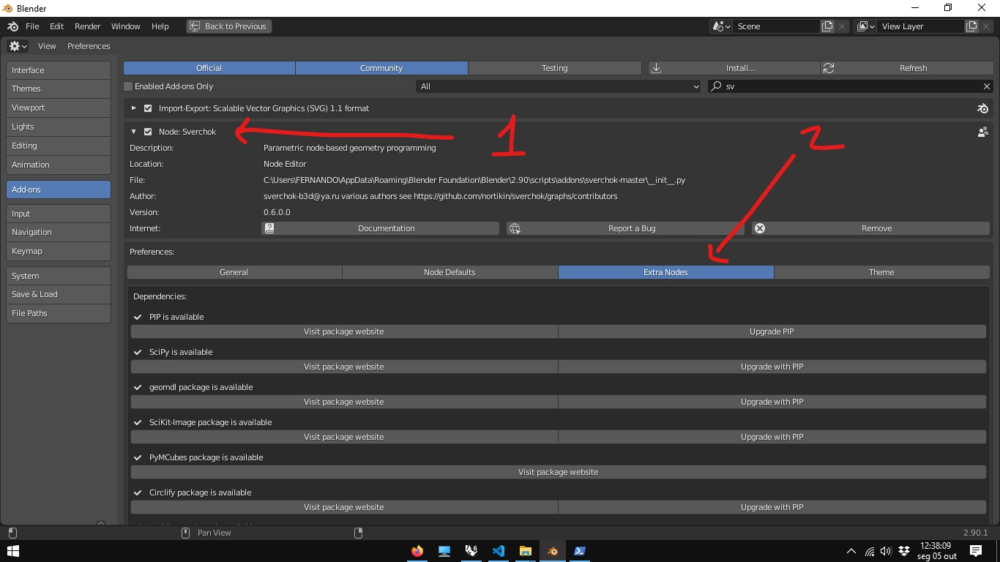
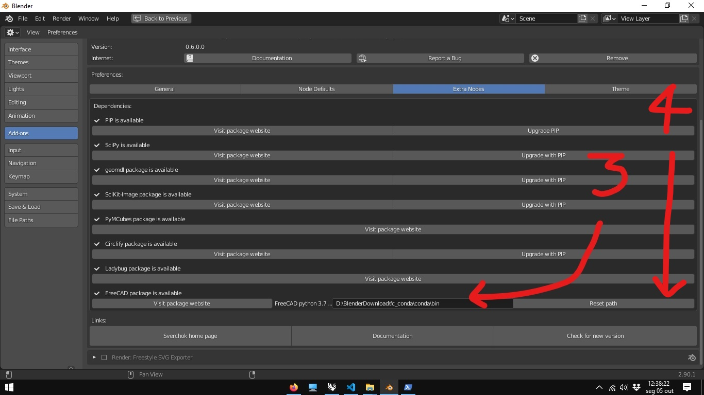

 # Instalando dependências do Sverchok
 

```shell
 ______ _    _ _______  ______ _______ _     _  _____  _     _
/______  \  /  |______ |_____/ |       |_____| |     | |____/
______/   \/   |______ |    \_ |_____  |     | |_____| |    \_
initialized.

```
## Habilitar o pip

Caso o pip não esteja habilitado para sua versão do Blender siga as [instruções de habilitação](./habilitar_o_pip.md)

1. Vá para o console do Python do Blender


1. digite as linhas de comando abaixo:

```Python
import site
site.getsitepackages()
```



1. Copie (ctrl + c) o segundo endereço mostrado pelo comando. Este endereço termina com uma pasta denominada como ***site-packages***.

2. Substitua o endereço abaixo endereço copiado no passo anterior (crtl + v). É recomendado fechar o Blender para quando for instalar programas usando o pip.

```shell
 .\Scripts\pip install --upgrade scipy geomdl SciKit-Image PyMCubes Circlify ladybug-core -t 'C:\\Program Files\\Blender Foundation\\Blender 2.90\\2.90\\python\\lib\\site-packages'
```

###### Na versão atual, o pip apresenta um erro na instalação das dependências do ladybug-core. Isso pode ser corrigido instalando o add-on do LadyBug no abaixo:
[https://blenderbim.org/download.html](https://blenderbim.org/download.html)

## Dependência do FreeCAD

#### Pode acontecer uma incompatibilidade entre a dependência do FreeCAD no Sverchok e o Plug-in Blender Bim. Caso deseje usar o Sverchok e o Blender Bim, talvez seja melhor não instalar esta dependência.

O **Freecad** é usado pelo **Sverchok** para a criação e manipulação de Sólidos. Atualmente o **Blender** utiliza o Python na versão 3.7.X. O **FreeCAD** 0.18 Utiliza a versão 3.6.x e o **FreeCAD** 0.19 (ainda não lançado oficialmente), utiliza a versão 3.8.x.

No entanto, é possível encontrar uma versão do **FreeCAD** compilada para o Python 3.7.x no endereço abaixo:

[sgrogan/FreeCAD](https://github.com/sgrogan/FreeCAD/releases/tag/PY3.7-win)

Baixe a versão conda-0.18.3.7z (recomenda-se o programa [7zip](https://www.7-zip.org/download.html) para extrair o conteúdo do arquivo)

Baixe e extraia o conteúdo para uma pasta com caminho conhecido. Aconselha-se caminhos próximos da raiz do disco (e.g. c:\freecad37\...)

Procure o endereço da pasta **bin** dentro das pastas descompactadas.



Execute o Blender como administrador.



###### Uma das maneiras de se abrir o **Blender** como administrador é : **1** No menu iniciar, clicar no ícone do **Blender** com o botão direito do mouse. **2** Clicar na opção **mais**. **3** Clicar na opção **Executar como Administrador**.

No menu Edit->Preferences vá para a opção Add-ons e procure o Sverchok (basta digitar **sv** no campo de pesquisa)

Abra as opções do Add-on Sverchok e procure a opção **extra nodes**



Na opção **FreeCAD Package** copie o endereço da pasta **bin** da versão descompactada e aperte o botão **Reset Path**



Caso ocorra algum problema em algum passo da instalação, consulte a documentação do [add-on](https://github.com/nortikin/sverchok/).

## FIM